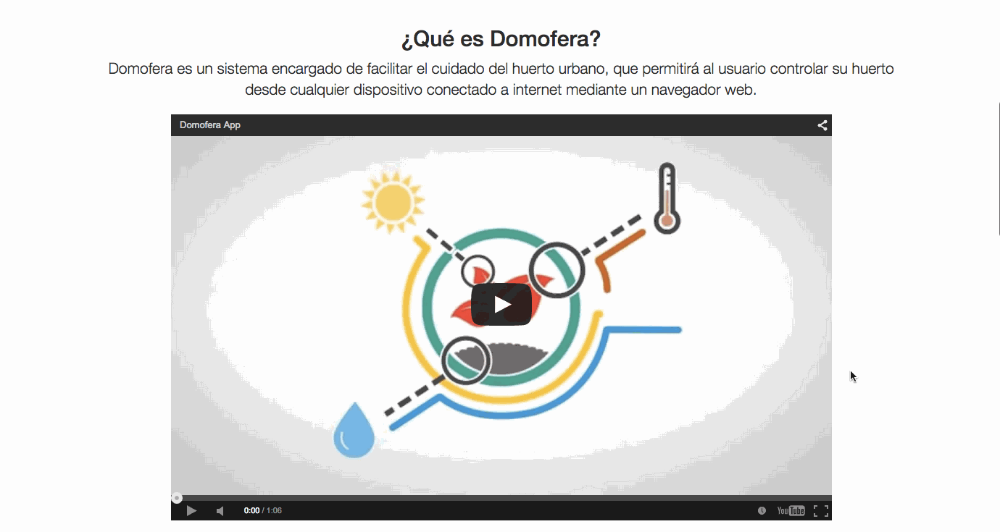
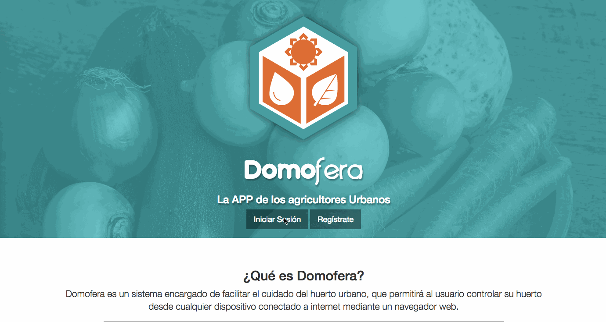
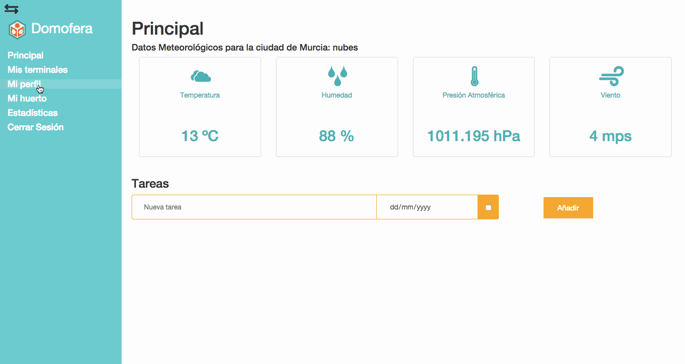
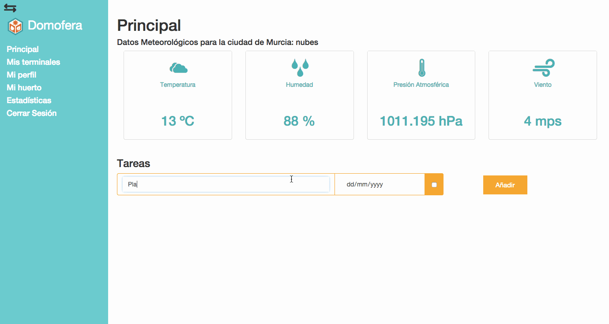
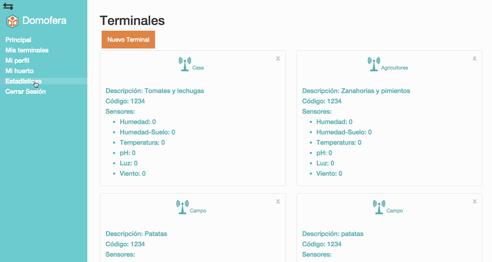
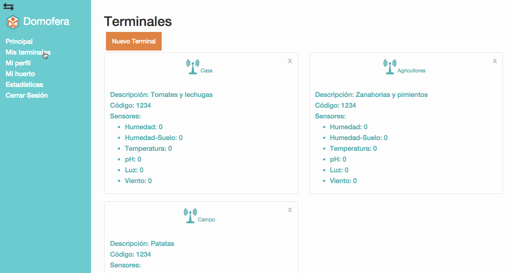
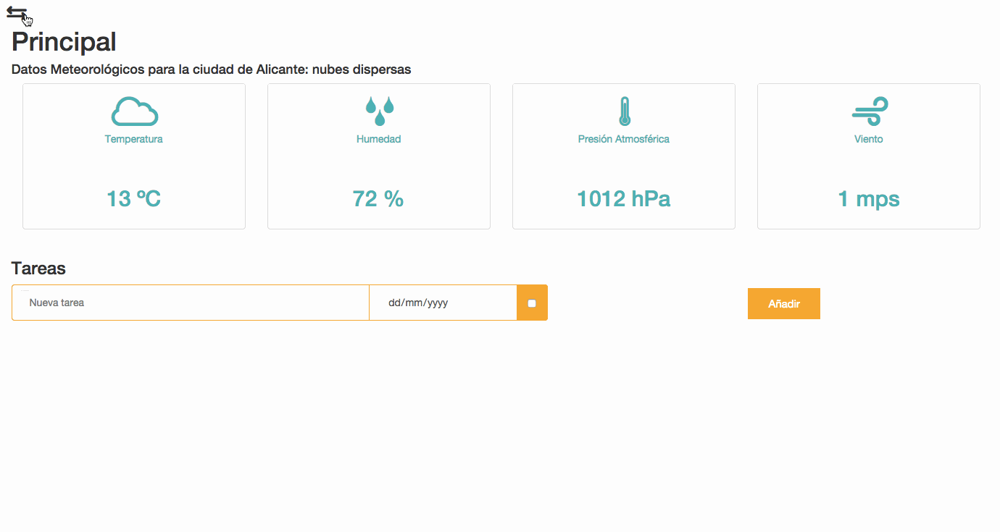

#Domofera APP
##ES

Domofera es un proyecto para desarrollar una aplicación enfocada a la agricultura urbana. Proponemos no sólo generar un producto, sino concienciar a la gente de la importancia de la aparición de la agricultura para el consumo propio en las ciudades y sus beneficios tanto sociales como para el medio ambiente.

Para ello, Domofera está desarrollando:

* Un dispostivo con sensores que midan temperatura, humedad del aire, humedad del suelo y otros parámetros, y que se conecte a Internet para enviar los datos.
* Una aplicación online diseñada para poder utilizarse desde cualquier tipo de dispositivo, a través de la cual los usuarios podrán registrar sus sensores y saber el estado de sus huertos estén donde estén.
* Un MOOC para todo aquel que quiera iniciarse en el mundo de la agricultura urbana.
 
##EN

Domofera is a project which purpose is to develop an application focused on urban agriculture. We aim not only to create a product, we want to concienciate people about the importance of the agriculture in cities and its benefits both social and environmental. 

Domofera will develop:

* A device provided with sensors which will measure temperature, air humidity, ground humidity and other parameters, and which is able to connect to the Internet in order to send data.
* An online application designed to be used from any kind of device, so the users will be able to register their sensors and to know their gardens state wherever they are.
* A MOOC for anyone who wants to start in the urban agriculture world.

##References

[Angular-Rails Tutorial](http://angular-rails.com/)

##Live Demo

